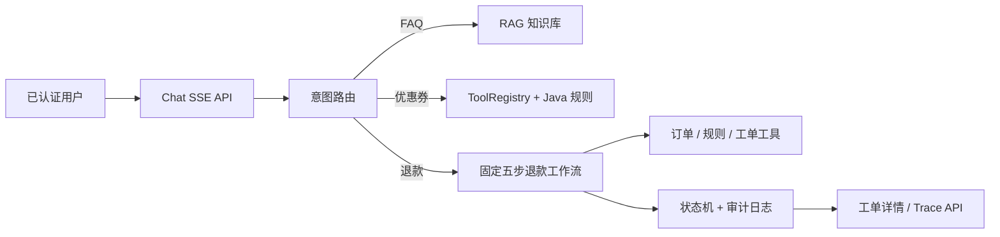

# 智能售后工单 Agent MVP

面向电商售后客服的 Java 后端项目。它把大模型限定在意图识别、知识问答和受控表达三个位置；订单、优惠券、退款资格与工单状态均由 Java 规则、工具白名单和持久化状态机控制。

> 退款场景只生成本地 `WAIT_HUMAN` 人工审核工单，**不会调用支付、退款、账户或外部客服系统**。

## 已实现的三个演示场景

1. FAQ：RAG 检索售后规则并返回真实引用来源。
2. 优惠券分析：`orderQuery`、`couponQuery` 经白名单工具调用，Java 规则给出结论，模型只负责解释。
3. 退款资格：创建/复用幂等工单，异步执行订单查询、规则检索、Java 判定和摘要，并通过 SSE 推送进度。



## 技术栈

- Java 21、Spring Boot 3.5.8、MyBatis、Flyway
- Spring AI 1.1.2、Spring AI Alibaba、DashScope（可选）
- Qdrant（local profile）、MySQL、Redis（local profile）
- H2 + Mock AI（测试环境）
- SSE、受控工具注册表、RAG 引用、异步有界线程池

## 关键设计

- 身份仅由 `X-Demo-User-Id` 验证后注入；请求体、模型输出和 SSE 内容不能指定 userId。
- 工具按意图白名单执行，并具备参数校验、2 秒超时、失败审计与 owner SQL 谓词。
- 退款工作流只允许 `PENDING → RUNNING → WAIT_HUMAN | FINISHED | FAILED`。
- 工单幂等键采用 `refund:v1:` + SHA-256，避免把 session/order 原文持久化。
- SSE 退款顺序：`status → ticket → status* → message → done`。
- `GET /api/tickets/{id}` 与 `GET /api/tickets/{id}/trace` 都在 SQL 中施加 owner 限制；不存在和越权统一返回 404。

## 验证

本地已用 Java 21 执行：

```powershell
$jdkHome = 'C:\Program Files\Microsoft\jdk-21.0.12.8-hotspot'
$mavenHome = 'C:\Users\fyq\tools\apache-maven-3.9.16'
$env:JAVA_HOME = $jdkHome
$env:MAVEN_HOME = $mavenHome
$env:Path = "$jdkHome\bin;$mavenHome\bin;" + $env:Path
.\mvnw.cmd test
```

当前完整测试覆盖 mock/H2 下的身份边界、RAG、工具治理、优惠券规则、退款状态机、异步工作流、SSE 与工单越权防护。

## 真实依赖运行

`local` profile 使用 MySQL、Redis、Qdrant 和可选 DashScope。配置项位于 [application-local.yml](src/main/resources/application-local.yml)，运行前需提供：

```powershell
$env:MYSQL_HOST = '127.0.0.1'
$env:MYSQL_PORT = '3306'
$env:MYSQL_DATABASE = 'after_sale_agent'
$env:MYSQL_USER = '<user>'
$env:MYSQL_PASSWORD = '<password>'
$env:REDIS_HOST = '127.0.0.1'
$env:REDIS_PORT = '6379'
$env:QDRANT_HOST = '127.0.0.1'
$env:QDRANT_GRPC_PORT = '6334'
.\mvnw.cmd -Dspring-boot.run.profiles=local spring-boot:run
```

DashScope 接入需额外启用 `dashscope` profile 并配置有效 API Key；未配置时使用 mock profile，项目不会伪称已调用真实模型。

## 接口示例

所有 `/api/**` 请求均需 `X-Demo-User-Id`。演示退款用户是 `10002`，其订单为 `O2001`。

```bash
curl -N -X POST http://localhost:8080/api/chat/stream \
  -H "X-Demo-User-Id: 10002" \
  -H "Content-Type: application/json" \
  -d '{"sessionId":"<已创建会话>","message":"我要退货，订单号 O2001"}'

curl -H "X-Demo-User-Id: 10002" http://localhost:8080/api/tickets/<ticketId>
curl -H "X-Demo-User-Id: 10002" http://localhost:8080/api/tickets/<ticketId>/trace
```
